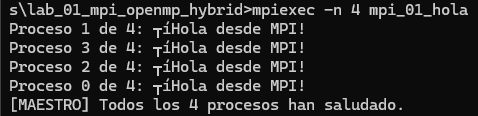
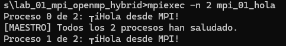
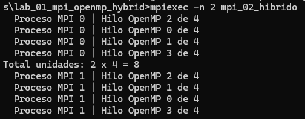
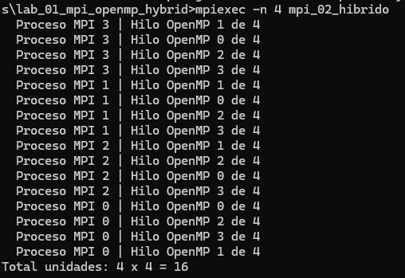
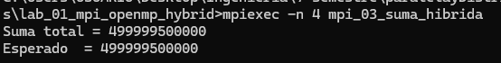
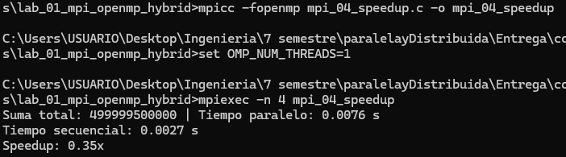
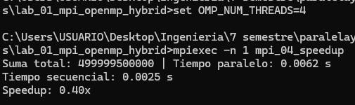
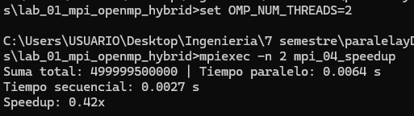
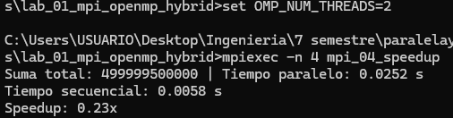

# Lab MPI + OpenMP — Juan David Miranda Pelaez & Cristhian David Parra Parada
 
## Ejercicio 1 — Hola Mundo MPI
**Descripción breve** Cada proceso MPI imprime su rank y el total de procesos. El proceso
 maestro (rank 0) imprime un mensaje adicional al final.

**Pantallazo:** 

**¿Por qué el orden de salida varía entre ejecuciones?**
Porque los procesos se ejecutan al mismo tiempo y compiten por imprimir 
en la consola. El primero que logre enviar su salida es el que sale primero,
es un tema de qué proceso atiende primero el sistema operativo.

**¿Qué pasaría si ejecutas con -n 1?**
El programa corre sin errores, pero deja de ser paralelo. Tendríamos un solo proceso (el maestro) 
haciendo todo el trabajo, como si fuera un programa secuencial normal en C.

**¿Para qué sirve MPI_COMM_WORLD?**
Es el comunicador global. Funciona como el "grupo" principal donde están todos los procesos que
lanzamos, permitiendo que se reconozcan y se puedan enviar mensajes entre ellos.

## Ejercicio 2 — OpenMP dentro de MPI
**Descripción breve:** Dentro de cada proceso MPI se lanza una región paralela OpenMP con 4 hilos. 
Cada hilo imprime su ID junto con el rank del proceso que lo contiene. Al final, el maestro calcula 
el total de unidades de cómputo activas.
**Pantallazo:** 
**Pantallazo — 2 procesos MPI × 4 hilos:**

**Pantallazo — 4 procesos MPI × 4 hilos:**

**Con 2 procesos MPI y 4 hilos OMP, ¿cuántas unidades de cómputo hay?**
Hay 8 unidades de cómputo en total. Son 2 procesos independientes, y cada uno despliega 4 hilos trabajando al 
mismo tiempo.

**¿Diferencia entre -n 4 (4 MPI, 4 hilos) vs -n 1 (1 MPI, 16 hilos)?** Con 4 procesos MPI, la memoria 
está dividida y protegida, pero consume más recursos del sistema. Con 1 proceso y 16 hilos, todos
comparten la misma memoria, lo que es súper rápido para acceder a los datos, pero corremos el 
riesgo de sobrescribir variables si no tenemos cuidado. Además, lanzar 16 hilos en un procesador que 
tiene menos hilos lógicos físicos solo va a causar que se saturen y peleen por el procesador.

**¿Por qué MPI_Init_thread en lugar de MPI_Init?**
Porque le estamos avisando a MPI que nuestro código va a manejar hilos internos (OpenMP).
Así, MPI ajusta su nivel de seguridad para evitar que varios hilos intenten mandar mensajes
de red al mismo tiempo y colapsen el programa.

## Ejercicio 3 — Suma Híbrida
**Descripción breve:** El proceso maestro inicializa un vector y lo reparte para que los hilos internos
de cada proceso lo sumen de forma paralela.
**Pantallazo:** 

**¿Qué hace exactamente MPI_Scatter?**
Toma el arreglo completo que solo tiene el proceso maestro y lo divide en partes matemáticas exactas. Luego, 
le envía por debajo un pedazo a cada uno de los demás procesos para que trabajen.

**¿Por qué reduction(+:suma_local) y no una variable compartida?**
Si usamos una variable compartida normal, todos los hilos intentarían sumarle valores al mismo
tiempo, pisándose unos a otros (condición de carrera) y dañando el resultado. La reducción 
hace que cada hilo sume en una variable privada y, al terminar, el sistema une todas 
las sumas de forma segura.

**¿Qué pasaría si olvidaras MPI_Reduce e imprimieras suma_local en rank 0?**
El resultado final estaría mal. El maestro (rank 0) solo imprimiría la suma del
pedacito de arreglo que le tocó a él, dejando por fuera todo el trabajo que
hicieron los demás procesos.

## Ejercicio 4 (Reto) — Speedup
**Descripción:** Se añade medición de tiempos con MPI_Wtime() al Ejercicio 3 para comparar el rendimiento secuencial vs el
 paralelo puro e híbrido.

**Tabla de resultados:**
| Configuración   | Procesos MPI | Hilos OMP | Tiempo (s) | Speedup |
|-----------------|:------------:|:---------:|:----------:|:-------:|
| Secuencial      | 1            | 1         | 0.0025 s   | 1.00×   |
| Solo MPI        | 4            | 1         | 0.0076 s   | 0.33×   |
| Solo OMP        | 1            | 4         | 0.0062 s   | 0.40×   |
| MPI + OMP       | 2            | 2         | 0.0064 s   | 0.39×   |
| MPI + OMP       | 4            | 2         | 0.0252 s   | 0.10    |

**Pantallazo:** 

**¿Coincide con la Ley de Amdahl?**
Sí, los resultados reflejan la limitación impuesta por la parte secuencial del código. En este caso, el tiempo de 
procesamiento es tan breve que el costo de inicializar el entorno paralelo y comunicar los datos con MPI_Scatter y MPI_Reduce 
se vuelve dominante. Esto causa que el Speedup sea menor a 1, confirmando que si la fracción secuencial o de gestión es alta,
añadir más procesos no mejora el tiempo.

**¿Por qué más procesos/hilos no siempre dan mayor speedup?**
Aumentar el número de procesos e hilos eleva el "overhead" de coordinación. En la configuración de 4 procesos y 2 hilos, el
tiempo subió drásticamente a 0.0252 s. Esto sucede porque el sistema gasta más tiempo gestionando la comunicación entre 
procesos y la sincronización de hilos que realizando la suma propiamente dicha, llegando a un punto de saturación donde el 
paralelismo perjudica el rendimiento.

**¿Qué overhead introduce MPI que no existe en OpenMP puro?**
MPI introduce una carga significativa debido a la gestión de memoria distribuida. Mientras que OpenMP comparte la memoria 
entre hilos, MPI debe realizar copias físicas de los datos para enviarlos a través de los diferentes procesos. Este
intercambio de mensajes y la necesidad de sincronizar procesos independientes generan un retraso adicional que 
no está presente en el modelo de hilos de memoria compartida.
 
## Conclusiones
Impacto de la comunicación: Se determinó que el uso de funciones colectivas como MPI_Scatter y MPI_Reduce tiene
un costo temporal alto que debe ser compensado con una carga de trabajo mayor para justificar el paralelismo.

Escalabilidad limitada: El descenso del Speedup al aumentar la complejidad de la configuración 
demuestra que existe un límite físico y lógico donde el costo de administrar más recursos supera el 
beneficio de la división de tareas.

Ventaja de hilos sobre procesos: En las pruebas con 4 unidades totales, la configuración de "Solo OMP" fue 
ligeramente más eficiente que "Solo MPI", resaltando que la comunicación por memoria compartida es menos 
costosa que el paso de mensajes en problemas de baja complejidad.

Balance del modelo híbrido: El modelo híbrido busca lo mejor de ambos mundos, pero requiere un equilibrio preciso; 
una mala configuración puede disparar el tiempo de ejecución si no se controla el overhead de gestión.

